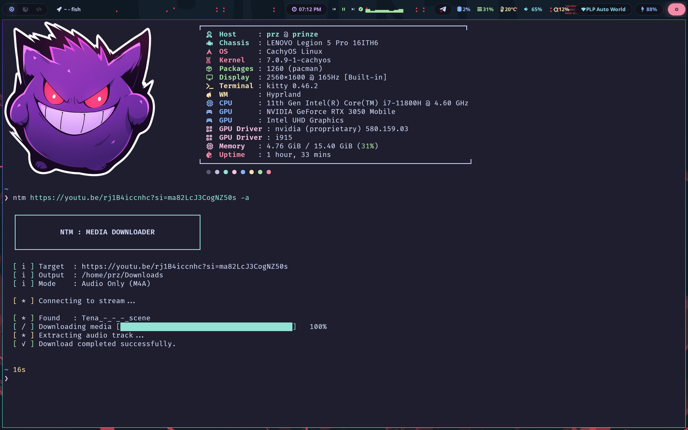

# ntm - Media Downloader

`ntm` is a lightning-fast, zero-friction CLI media downloader written in **`Go`**. It acts as a smart wrapper around `yt-dlp`, but removes the headache of managing Python dependencies, keeping binaries updated, or struggling with slow single-threaded download speeds. 

Just give it a URL, and it does the rest. (Currently supporting only YouTube URLs.)

## Preview
```bash
  ┌──────────────────────────────────────────┐
  │                                          │
  │          NTM : MEDIA DOWNLOADER          │
  │                                          │
  └──────────────────────────────────────────┘

  [ i ] Target  : https://www.youtube.com/watch?v=example
  [ i ] Output  : /example/directory/Downloads
  [ i ] Mode    : Audio Only (M4A)

  [ * ] Connecting to stream...
  [ * ] Found   : EXAMPLE_-_OFFICIAL_MUSIC_VIDEO
  [ / ] Downloading media [██████████████████████████████░░░░░░░░░░]   75.0%
  [ ✓ ] Download completed successfully.
```
---




## Features

- **Zero-Dependency Ecosystem**: ntm automatically bootstraps the latest standalone yt-dlp binary along with static builds of ffmpeg and ffprobe into your local configuration directory on the very first run. No Python or system-wide codec installations are required.
- **Warp Speed**: Bypasses bandwidth throttling constraints by automatically splitting media downloads into concurrent multi-threaded streams.
- **Smart Defaults**: Defaults to 1080p video quality (to prevent accidental massive downloads) and routes files directly to your system's native Downloads folder.
- **High-Speed Audio Extraction**: One flag to isolate and extract high-quality audio streams natively without unnecessary transcoding overhead.
- **Clean UI**: Keeps terminal noise to a absolute minimum. Real-time, single-line progress bars and clear human-readable error bubbling.


## Installation

Install the latest version globally using the automated install script:
### Linux / macOS (Bash):
```bash
curl -sL https://raw.githubusercontent.com/khemerak/ntm/main/install.sh | bash

```

### Windows (Powershell):
```powershell
iwr -useb https://raw.githubusercontent.com/khemerak/ntm/main/install.ps1 | iex
```

## Usage

By default, `ntm` downloads the best video available (up to 1080p) and saves it to your `~/Downloads` directory.

**Basic Video Download:**

```bash
ntm "https://youtu.be/example"

```

**Extract Audio Only (MP3):**

```bash
ntm "https://youtu.be/example" -a

```

**Change Video Quality:**

```bash
# Options: 1080p (default), 720p, best
ntm "https://youtu.be/example" -q 720p

```

**Custom Output Directory:**

```bash
ntm "https://youtu.be/example" -a -o ~/Music

```

**Force Redownload (Ignore Cache):**

```bash
ntm "https://youtu.be/example" -f

```

## Updating

To update ntm along with its underlying extractors to the latest available releases, simply invoke the built-in update route:
```Bash
ntm update
```

## Building from Source

If you want to compile the project manually:

```bash
git clone https://github.com/khemerak/ntm.git
cd ntm
go build -ldflags="-s -w" -o ntm ./cmd/ntm
sudo mv ntm /usr/local/bin/

```

